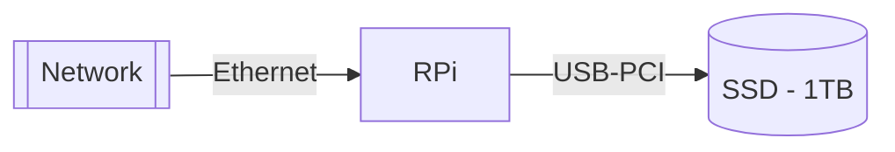

# NAS - Network Attached Storage


## NAS1



1. Update the Raspian distribution

	```bash
	sudo apt-get update
	sudo apt-get upgrade
	reboot
	```

2. Install `gparted` for storage management
	```bash
	sudo apt install gparted
	reboot
	```

3. Install samba for NAS management

	```bash
	sudo apt-get install samba samba-common-bin
	reboot
	```

4. Verify that the shared folders exist - `./flagella/` and `./cillia`:

	+ 128GB card - flagella
	+ 1TB SSD - cillia

5. Configure `samba` configuration file: sudo `nano /etc/samba/smb.conf` or `sudo open /etc/samba/smb.conf`
	```toml
	[flagella]
	path = /home/trappyscope/flagella
	writeable=Yes
	create mask=0777
	directory mask=0777
	public=Yes
	
	[cillia]
	path = /media/trappyscope/TrappyCloud
	writeable=Yes
	create mask=0777
	directory mask=0777
	public=Yes
	```

6. Create a. username and password:
	```bash
	sudo smbpasswd -a nas1 # enter: chlamy
	```

7. 
	```bash
	sudo chmod 0777 /home/trappyscope/flagella
	sudo chown nobody:nogroup /home/trappyscope/flagella
	sudo chmod 0777 /media/trappyscope/TrappyCloud
	sudo chown nobody:nogroup /media/trappyscope/TrappyCloud
	```

8. 

9. Restart samba service to load the configuration file
	```bash
	sudo systemctl restart smbd
	```

10. Try this:
	```toml
	[global]
	  server string = YOURSERVERNAME
	  workgroup = WORKGROUP
	  netbios name = %h
	  security = share
	  guest account = root
	  socket options = TCP_NODELAY IPTOS_LOWDELAY SO_RCVBUF=65536 SO_SNDBUF=65536
	  smb ports = 445
	  max protocol = SMB2
	  min receivefile size = 16384
	  deadtime = 30
	  os level = 20
	  mangled names = no
	  syslog only = yes
	  syslog = 2
	  name resolve order = lmhosts wins bcast host
	  preferred master = auto
	  domain master = auto
	  local master = yes
	  printcap name = /dev/null
	  load printers = no
	  browseable = yes
	  writeable = yes
	  printable = no
	  encrypt passwords = true
	  enable core files = no
	  passdb backend = smbpasswd
	  smb encrypt = disabled
	  use sendfile = yes
	
	[share]
	comment = Share
	path = /share
	available = yes
	browsable = yes
	writable = yes
	public = yes
	```

11. ## Finally

	```toml
	[global]
	  workgroup = MyWorkGroup
	  server string = Hello, use me
	  security = user
	  map to guest = Bad User
	  guest account = jonnie
	  passdb backend = tdbsam
	  
	[the_public_share]
	   path = /mysmbshare
	   writable = yes
	   printable = no
	   public = yes
	```

​	

```bash
[global]
  workgroup = WORKGROUP
  netbios name = HOMESERV
  security = user
  map to guest = Bad User

[disk1]
  comment = Disk 1 on 400GB HDD
  path = /media/disk1
  browsable = yes
  guest ok = yes
  read only = no
  create mask = 666
  directory mask = 777
  force user = jonnie
  force group = jonnie

[disk2]
  comment = Disk 2 on 400GB HDD
  path = /media/disk2
  browsable = yes
  guest ok = yes
  read only = no
  create mask = 666
  directory mask = 777
  force user = jonnie
  force group = jonnie
```


### Extras

1. To reset to default: a completw purge is recommended:

	```bash
	sudo apt-get purge samba samba-common
	sudo rm -rf /etc/samba/ /etc/default/samba
	sudo apt-get install samba
	```

2. 


https://pimylifeup.com/raspberry-pi-samba/

https://www.mongodb.com/developer/products/mongodb/mongodb-on-raspberry-pi/


