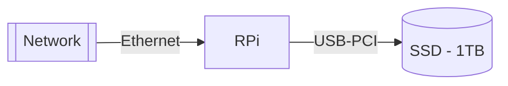

# NAS - Network Attached Storage


## NAS1



1. Update the Raspian distribution

	```bash
	sudo apt-get update
	sudo apt-get upgrade
	reboot
	```

2. Install `gparted` for storage management
	```bash
	sudo apt install gparted
	reboot
	```

3. Install samba for NAS management

	```bash
	sudo apt-get install samba samba-common-bin
	```

4. Verify that the shared folders exist - `./flagella/` and `./cillia`:

	+ 128GB card - flagella
	+ 1TB SSD - cillia

5. Configure `samba` configuration file: sudo `nano /etc/samba/smb.conf` or `sudo open /etc/samba/smb.conf`
	```toml
	[flagella]
	path = /home/trappyscope/flagella
	writeable=Yes
	create mask=0777
	directory mask=0777
	public=Yes
	
	[cillia]
	path = /media/trappyscope/TrappyCloud
	writeable=Yes
	create mask=0777
	directory mask=0777
	public=Yes
	```

6. Create a. username and password:
	```bash
	sudo smbpasswd -a nas1 # enter: chlamy
	```

7. Restart samba service to load the configuration file
	```bash
	sudo systemctl restart smbd
	```

8. 


https://pimylifeup.com/raspberry-pi-samba/

https://www.mongodb.com/developer/products/mongodb/mongodb-on-raspberry-pi/


